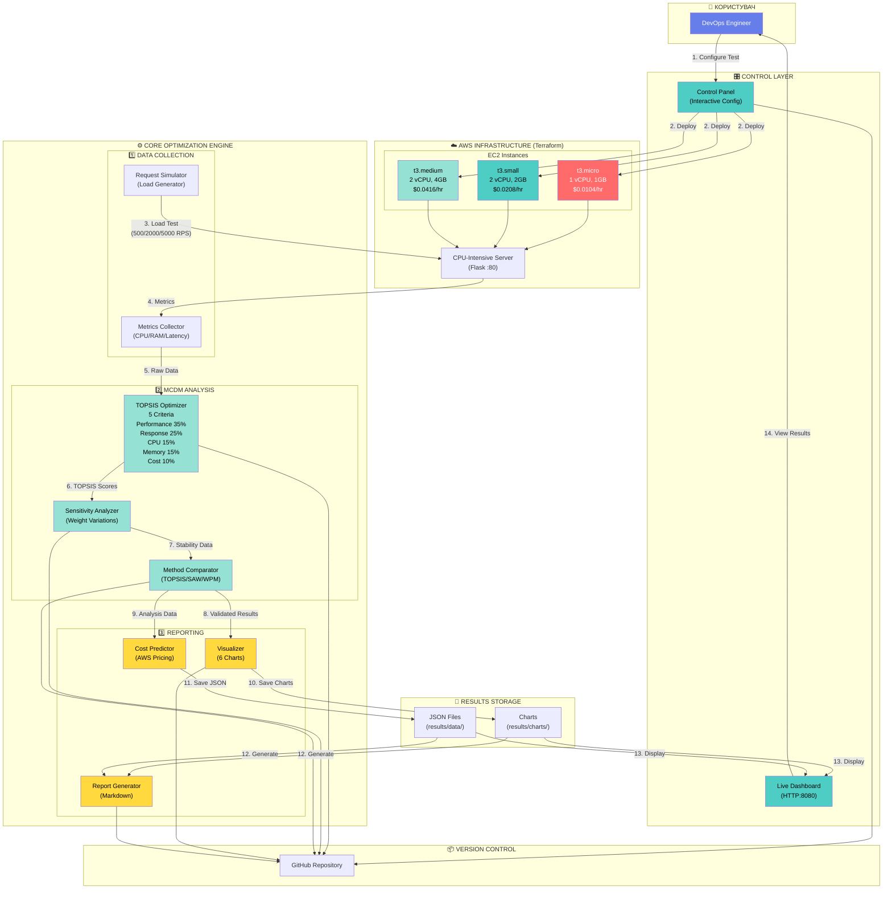
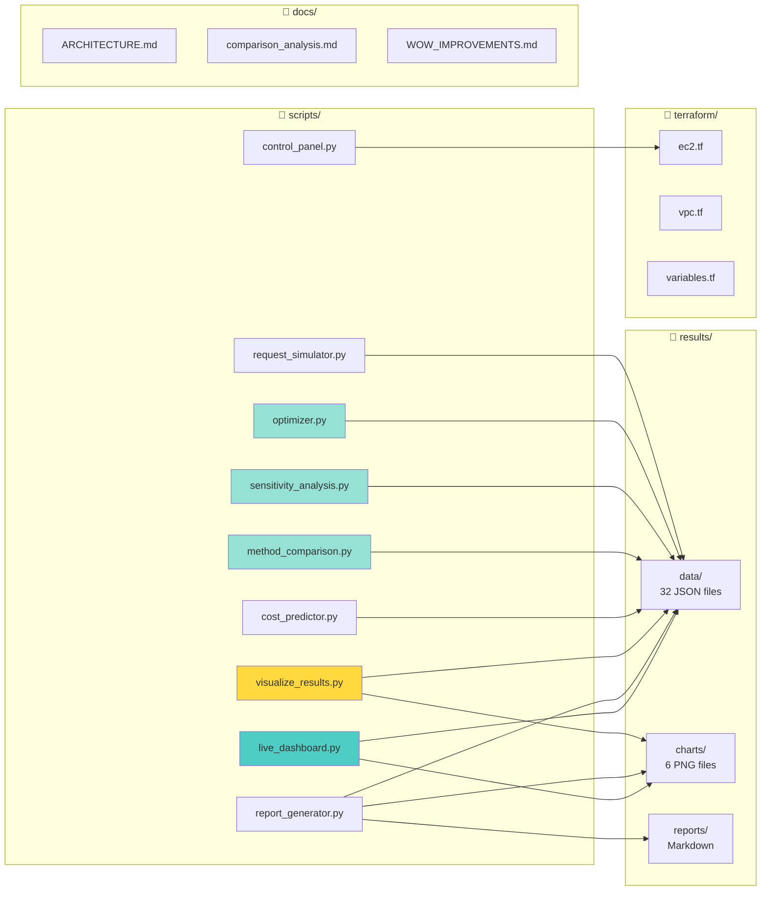
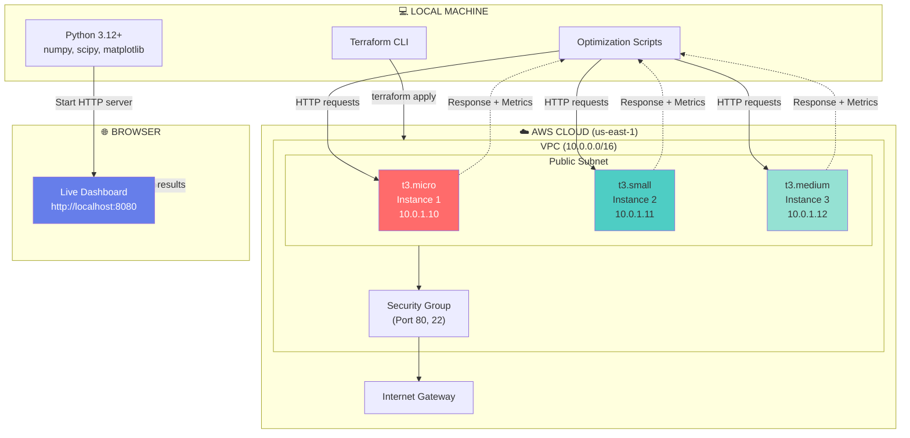
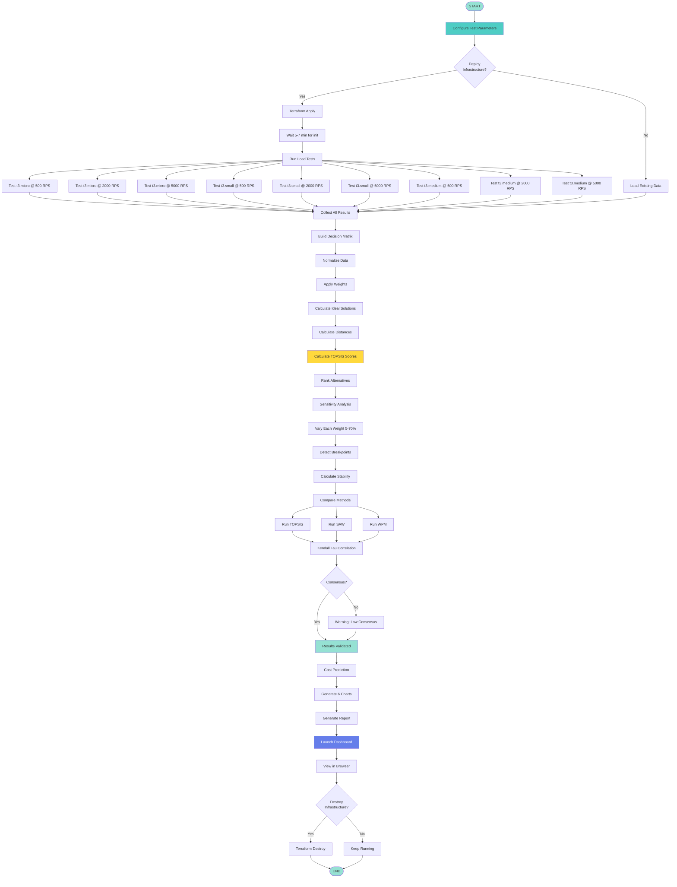
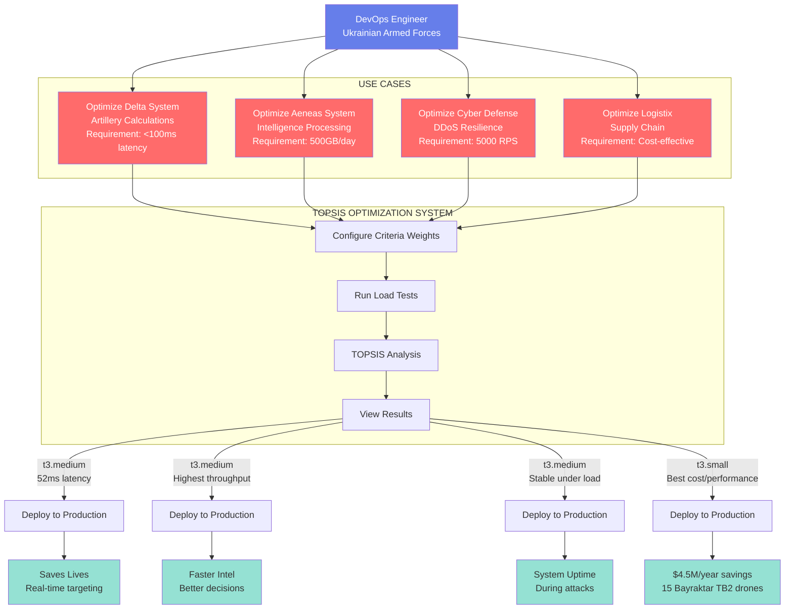

# 📐 Діаграма архітектури системи

## Візуалізація в Mermaid (для GitHub/Markdown)



---

## Діаграма послідовності (Sequence Diagram)

```mermaid
sequenceDiagram
    actor User as DevOps Engineer
    participant CP as Control Panel
    participant TF as Terraform
    participant EC2 as EC2 Instances
    participant SRV as CPU Server
    participant RS as Request Simulator
    participant OPT as TOPSIS Optimizer
    participant SA as Sensitivity Analysis
    participant CMP as Method Comparison
    participant VIS as Visualizer
    participant DB as Dashboard

    User->>CP: 1. Configure test parameters
    CP->>User: Show configuration UI
    User->>CP: Confirm (RPS: 500/2000/5000)

    CP->>TF: 2. terraform apply
    TF->>EC2: Deploy 3 instances
    EC2->>SRV: Start Flask server (:80)
    SRV-->>EC2: Health check OK
    EC2-->>TF: Deployment complete
    TF-->>CP: Infrastructure ready

    loop For each instance & RPS level
        CP->>RS: 3. Start load test
        RS->>SRV: Send HTTP requests (60s)
        SRV-->>RS: Response + metrics
        RS->>RS: Collect CPU, RAM, latency
        RS-->>CP: Save test_results.json
    end

    CP->>OPT: 4. Run optimization
    OPT->>OPT: Build decision matrix
    OPT->>OPT: Normalize & weight
    OPT->>OPT: Calculate TOPSIS scores
    OPT-->>CP: optimization_results.json

    CP->>SA: 5. Sensitivity analysis
    SA->>SA: Vary weights 5% to 70%
    SA->>SA: Detect breakpoints
    SA->>SA: Calculate stability indices
    SA-->>CP: sensitivity_analysis.json

    CP->>CMP: 6. Method comparison
    CMP->>CMP: Run TOPSIS, SAW, WPM
    CMP->>CMP: Calculate Kendall Tau
    CMP-->>CP: method_comparison.json

    CP->>VIS: 7. Generate visualizations
    VIS->>VIS: Create 6 charts (300 DPI)
    VIS-->>CP: Save to results/charts/

    User->>DB: 8. Open http://localhost:8080
    DB->>DB: Load JSON + charts
    DB-->>User: Display live dashboard

    CP->>TF: 9. terraform destroy
    TF->>EC2: Terminate instances
    EC2-->>TF: Cleanup complete
```

---

## Діаграма компонентів (Component Diagram)



---

## Діаграма розгортання (Deployment Diagram)



---

## Потік даних (Data Flow Diagram)



---

## Алгоритм TOPSIS (Покроковий)

```mermaid
flowchart TD
    Input[INPUT:<br/>Decision Matrix X<br/>m alternatives × n criteria<br/>Weights W<br/>Benefit/Cost indicators]

    Input --> Step1[STEP 1: Normalization<br/>r_ij = x_ij / sqrt(sum x_ij²)]

    Step1 --> Step2[STEP 2: Weighted Matrix<br/>v_ij = w_j × r_ij]

    Step2 --> Step3A[STEP 3a: Ideal Solution A+<br/>max(v_ij) for benefit<br/>min(v_ij) for cost]
    Step2 --> Step3B[STEP 3b: Anti-Ideal Solution A-<br/>min(v_ij) for benefit<br/>max(v_ij) for cost]

    Step3A --> Step4[STEP 4: Calculate Distances]
    Step3B --> Step4

    Step4 --> D_plus[D+ = sqrt(sum (v_ij - A+_j)²)]
    Step4 --> D_minus[D- = sqrt(sum (v_ij - A-_j)²)]

    D_plus --> Step5[STEP 5: TOPSIS Score<br/>C_i = D- / (D+ + D-)]
    D_minus --> Step5

    Step5 --> Step6[STEP 6: Rank Alternatives<br/>Sort by C_i descending]

    Step6 --> Output[OUTPUT:<br/>Rankings<br/>Scores (0-1)<br/>Best Alternative]

    style Input fill:#4ECDC4
    style Step1 fill:#95E1D3
    style Step2 fill:#95E1D3
    style Step3A fill:#FFD93D
    style Step3B fill:#FFD93D
    style Step5 fill:#FF6B6B,color:#fff
    style Output fill:#95E1D3
```

---

## Приклад використання (Use Case)



---

## Як використовувати ці діаграми

### У презентації PowerPoint:
1. Відкрийте цей файл на GitHub (діаграми автоматично рендеряться)
2. Зробіть screenshot кожної діаграми
3. Вставте в слайди

### У звіті (PDF):
1. Використайте online Mermaid renderer: https://mermaid.live/
2. Скопіюйте код діаграми
3. Експортуйте як PNG/SVG
4. Вставте в документ

### У GitHub README:
```markdown
# Architecture

See [ARCHITECTURE_DIAGRAM.md](docs/ARCHITECTURE_DIAGRAM.md) for detailed system diagrams.
```

Діаграми автоматично відображатимуться на GitHub!

---

*Створено для магістерської роботи, 2025*
*Використані інструменти: Mermaid Diagrams (Markdown-native)*
